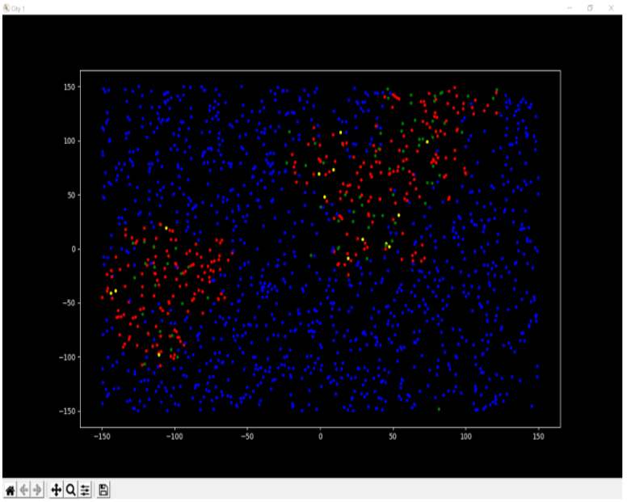
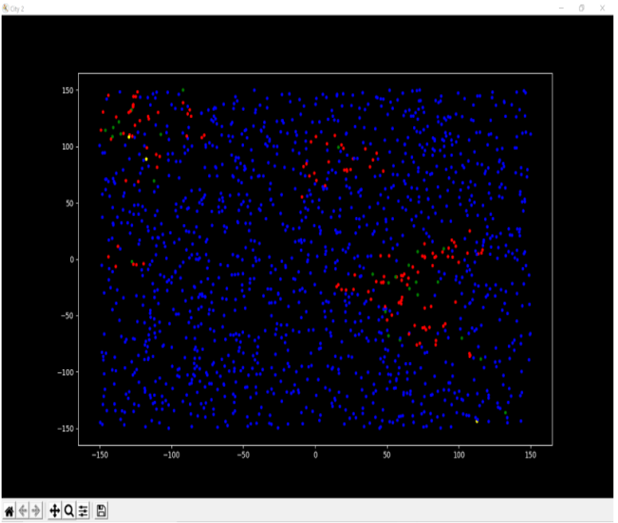

# Simulation-of-SIR-model-of-Covid
This project includes an agent – based SIR model to simulate the transmission of viral vectors within a community.  
It helps in evaluating and predicting the effect of the implementation of different guidelines and protocols 
(for example, more extensive screening for the disease or stricter social-distancing measures), 
which typically results in a change in the model parameters.  
## Key features
- It implements a comparison based simulation in two situations with some constraints that represent mitigation policies which includes-  mask wearing, social distancing,   sanitary hygiene etc.       
- It analyzes a viral pandemic situation like Covid – 19 using the real data.
- It also visualizes the simulation using various libraries available in python.

## Simulation Result

#### SITUATION-1: Without any constraints
 
#### SITUATION-2: With all constraints like mask wearing, social distancing, sanitary hygiene, etc. 
 
 
